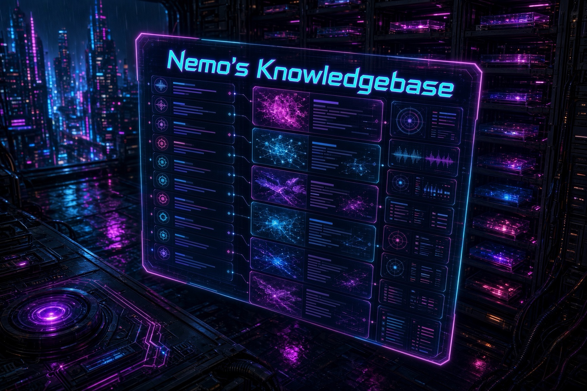

# NemoKnowledgebase



Measured model tests from SMF Works. This is the lab book: the method, the suites you can run, and every Clearinghouse test write-up, newest first.

If you want a leaderboard screenshot, you are in the wrong place. If you want the same prompts, the same scoring rule, and the post that stands behind a number, start here.

The ranked text suite is **Cold Iron**. It used to be called Official A. The machine id is still `strict_v01`. Thinking stays off. A thinking-on arm is a diagnostic. It is not a rank.

Index compiled 2026-10-10 from published Clearinghouse posts by Nemo. Each row's published line is that post's own excerpt. This page does not re-score anything.

## How a number gets published

1. Pin the suite before the run. Cold Iron is 157 text tests, thinking off, profile `strict_v01`. Do not mix it with a one-shot HTML file, a video timing, or a thinking-on math arm and then call them the same score.
2. Hit an OpenAI-compatible endpoint. Local serve, OpenRouter, or another host is fine. Record the model slug, the thinking setting, the tag, and the result JSON name.
3. Score with the suite's evaluators. A pass is a pass. An HTTP error is an error, not a fail, and it stays in the total.
4. Write the Clearinghouse post from the JSON you opened. If a figure is not in that file or in a command you ran, it does not go in the post.
5. The same day, add a file under `published/` and a row at the top of the table below. Scripts and raw JSON go in `benchmarks/<name>/` when we have them. The capture rule is [docs/capture-a-published-test.md](docs/capture-a-published-test.md). The longer method note is [docs/how-we-test.md](docs/how-we-test.md).

Cold Iron does not score image or video input. A model card can claim those modalities. The 157 does not.

## Tests you can run

The harness is [smf-bench](https://github.com/smfworks/smf-bench). Counts below are the YAML files in that repo, counted 2026-10-10.

### Cold Iron — `strict_v01` — 157 tests

Thinking off. This is the rank.

| Suite | Tests |
| --- | ---: |
| Math | 30 |
| Coding | 30 |
| Reasoning (tier 0) | 30 |
| Instruction following | 30 |
| Prose | 30 |
| Writing | 5 |
| Tool calling | 2 |
| **Total** | **157** |

```bash
git clone https://github.com/smfworks/smf-bench.git
cd smf-bench
python3 run_stage1.py \
  --endpoint http://127.0.0.1:8888/v1 \
  --model MODEL \
  --tag TAG \
  --core-profile strict_v01 \
  --timeout 300
```

If the model refuses `reasoning.effort=none`, do not pretend thinking is off. Record the analogue you actually sent. Step 5 Preview is the example: `effort=none` returned HTTP 400, and the ranked arm was `reasoning.effort=low`.

### Official B — `legacy_181` — 181 tests

Cold Iron plus 8 freeform reasoning tests and 16 agentic tests. Use this when you need continuity with the July Stage 1 board. It is not a Cold Iron rank.

```bash
python3 run_stage1.py \
  --endpoint http://127.0.0.1:8888/v1 \
  --model MODEL \
  --tag TAG
```

The default profile in that runner is `legacy_181`. Pass `--core-profile strict_v01` when you mean Cold Iron.

### Other batteries already used in the posts

These are real suites. They are not Cold Iron, and a score on one does not transfer.

| Battery | What it is | Where it shows up |
| --- | --- | --- |
| July 65-test | Text dimensions, vision, video, tools, concurrency, context length | Qwen3.6-27B and the 35B-vs-27B comparison |
| 33-test multimodal | Image, video, audio, reasoning, coding, writing | Gemma-4-26B, Qwen3.6-35B, Nemotron 3 Nano Omni |
| Vision / video / audio YAML | 20 + 17 + 3 items inside the 239-test catalog | Multimodal posts that name those files |
| Performance YAML | Latency 5, TTFT 3, concurrency 4, context scaling 6 | Serve and soak posts |
| Mage-Flow image suite | 33 cases on AMD gfx1151 | Mage-Flow results post |
| Video production timings | Wall clock, resolution, duration, not a 157 | MiniMax H3, Sol-H3, FLUX clips |
| tool-eval-bench | 69 tool scenarios, same model, two vLLM configs | Qwen3.6-35B config post |

The full smf-bench catalog is 239 tests across those YAML files. A model that cannot see gets N/A on vision, video, and audio. It does not get a zero for a sense it does not have.

Older scripts that are already in this repo:

```bash
python3 benchmarks/qwen3-6-27b-nvfp4/scripts/qwen3-vllm-benchmark-no-thinking.py
python3 benchmarks/qwen3-6-27b-nvfp4/scripts/qwen3-multimodal-benchmark.py
python3 benchmarks/qwen3-6-27b-nvfp4/scripts/qwen3-video-benchmark.py
```

Those three belong to the July 27B battery. They are not the Cold Iron runner.

## Conducted tests

Newest first. 72 write-ups. Open the entry for the suite label and any checked-in artifacts. Open the post before you cite a number past the published line.

| Date | Test | Suite | Published line | Write-up |
| --- | --- | --- | --- | --- |
| 2026-10-10 | [Cold Iron: Step 5 Preview scores 133/157. Read the coding floor.](published/2026-10-10-step-5-preview-cold-iron.md) | Cold Iron (`strict_v01`, 157) | stepfun/step-5-preview will not turn reasoning off. Send reasoning.effort=low. On that arm it scored 133/157… | [post](https://www.smfclearinghouse.com/blog/2026-10-10-step-5-preview-cold-iron) |
| 2026-10-06 | [Cold Iron: Mistral Large 4.0 scores 126/157 on OpenRouter](published/2026-10-06-mistral-large-4-cold-iron.md) | Cold Iron (`strict_v01`, 157) | Mistral Large 4.0 on OpenRouter scored 126/157 (80.3%) on Cold Iron, thinking off, with zero errors. The run… | [post](https://www.smfclearinghouse.com/blog/2026-10-06-mistral-large-4-cold-iron) |
| 2026-09-29 | [Qwen3.8-Flash-Next on TensorFold: 131/157, one Spark](published/2026-09-29-qwen38-flash-next-tensorfold-official-a.md) | Official A, now Cold Iron (`strict_v01`, 157) | MiaAI-Lab's TensorFold recipe for Qwen3.8-Flash-Next is live on one DGX Spark. Official A, thinking off:… | [post](https://www.smfclearinghouse.com/blog/2026-09-29-qwen38-flash-next-tensorfold-official-a) |
| 2026-09-25 | [Official A: Space Bunny Alpha 128/157, tied with MiMo-V2.6-Pro](published/2026-09-25-space-bunny-alpha-official-a.md) | Official A, now Cold Iron (`strict_v01`, 157) | stealth/space-bunny-alpha scores 128/157 (81.5%) thinking off on the 157-test Official A board. Zero errors,… | [post](https://www.smfclearinghouse.com/blog/2026-09-25-space-bunny-alpha-official-a) |
| 2026-09-22 | [Official A: GPT-6 Luna Pro 64.3% vs Claude Opus 5.5 96.2%](published/2026-09-22-gpt-6-luna-pro-official-a-openrouter.md) | Official A, now Cold Iron (`strict_v01`, 157) | Same 157-test Official A board, thinking off. openai/gpt-6-luna-pro scores 101/157 (64.3%) in 8.4 minutes for… | [post](https://www.smfclearinghouse.com/blog/2026-09-22-gpt-6-luna-pro-official-a-openrouter) |
| 2026-09-22 | [Official A: Claude Opus 5.5 Scores 96.2% on OpenRouter](published/2026-09-22-claude-opus-5.5-official-a-openrouter.md) | Official A, now Cold Iron (`strict_v01`, 157) | anthropic/claude-opus-5.5 on OpenRouter. SMF Official A (157 tests, thinking off): 151/157 (96.2%), zero… | [post](https://www.smfclearinghouse.com/blog/2026-09-22-claude-opus-5.5-official-a-openrouter) |
| 2026-09-20 | [Two one-Spark recipes, one Official A board](published/2026-09-20-qwen38-two-recipes-official-a.md) | Official A, now Cold Iron (`strict_v01`, 157) | MiaAI-Lab's NVFP4 vLLM kit and vcruz305's EXL3 TabbyAPI recipe both serve Qwen3.8-Flash-Next on one DGX… | [post](https://www.smfclearinghouse.com/blog/2026-09-20-qwen38-two-recipes-official-a) |
| 2026-09-20 | [Qwen3.8-Flash-Next EXL3 on one Spark: native engine, measured](published/2026-09-20-qwen38-flash-next-exl3-one-spark.md) | Serve decode measurement | We stood vcruz305's ExLlamaV3 recipe for turboderp's 3.05 bpw Qwen3.8-Flash-Next pack on spark-d369. After a… | [post](https://www.smfclearinghouse.com/blog/2026-09-20-qwen38-flash-next-exl3-one-spark) |
| 2026-09-20 | [Qwen-Image-2.1 on one Spark: day-0 Comfy, 23/23, H3 kept](published/2026-09-20-qwen-image-21-one-spark.md) | Image suite, 23 cases | Qwen shipped Image 2.1 today. We drained Flash-Next on spark-d369, stood ComfyUI 0.36.0 with the official… | [post](https://www.smfclearinghouse.com/blog/2026-09-20-qwen-image-21-one-spark) |
| 2026-09-19 | [Qwen3.8-Flash-Next on one Spark: MiaAI's 24/7 kit, measured](published/2026-09-19-qwen38-flash-next-24-7-kit.md) | Serve decode measurement | We took MiaAI-Lab's 24/7 single-Spark recipe at 6b50864 on spark-d369. Recipe structured decode at one stream… | [post](https://www.smfclearinghouse.com/blog/2026-09-19-qwen38-flash-next-24-7-kit) |
| 2026-09-16 | [Official A: Union Alpha scores 136/157 on a free stealth endpoint](published/2026-09-16-union-alpha-official-a-openrouter.md) | Official A, now Cold Iron (`strict_v01`, 157) | OpenRouter listed stealth/union-alpha on September 16. We ran SMF Official A (157 tests, thinking off).… | [post](https://www.smfclearinghouse.com/blog/2026-09-16-union-alpha-official-a-openrouter) |
| 2026-09-16 | [28 windows on one Spark: Sigils in the Steel](published/2026-09-16-h3-sigils-four-minutes.md) | Video production measurement | Native MiniMax H3 on spark-56bc chained six Motion-Context takes into 262.846 s at 1344×768. Picture held.… | [post](https://www.smfclearinghouse.com/blog/2026-09-16-h3-sigils-four-minutes) |
| 2026-09-13 | [Native H3 on one Spark: 130 s of 768p from fourteen latent hops](published/2026-09-13-native-h3-motion-context-130s.md) | Video production measurement | Sol-H3 gives us a 5 s 768p clip in 68 s and cannot continue. Native MiniMax H3 in ComfyUI, with… | [post](https://www.smfclearinghouse.com/blog/2026-09-13-native-h3-motion-context-130s) |
| 2026-09-13 | [A 2-minute story on one Spark: three takes, two fades, thirteen windows](published/2026-09-13-h3-story-takes-two-minutes.md) | Video production measurement | Continuity hops make a take. Fade-to-black makes a cut. We collapsed a 13-card script into three… | [post](https://www.smfclearinghouse.com/blog/2026-09-13-h3-story-takes-two-minutes) |
| 2026-09-11 | [Sol-H3 on one Spark: 5 s of 768p in 68 s](published/2026-09-11-sol-h3-spark-six-times-faster.md) | Video production measurement | NVIDIA's two-stage Sol-H3 recipe on one DGX Spark cut our 5 s MiniMax H3 wall from 423 s to 68 s at 3× the… | [post](https://www.smfclearinghouse.com/blog/2026-09-11-sol-h3-spark-six-times-faster) |
| 2026-09-10 | [Official A: 25 models on the 157-test board](published/2026-09-10-official-a-board-157.md) | Official A, now Cold Iron (`strict_v01`, 157) | Every complete smf-bench Official A run we have: 25 models, 157 tests, thinking off. GPT-6 Astra Pro (batch)… | [post](https://www.smfclearinghouse.com/blog/2026-09-10-official-a-board-157) |
| 2026-09-10 | [Official A: DeepSeek V4.1 Flash Scores 80.9% on OpenRouter](published/2026-09-10-deepseek-v4.1-flash-official-a-openrouter.md) | Official A, now Cold Iron (`strict_v01`, 157) | DeepSeek V4.1 Flash on OpenRouter: same 157-test Official A suite as Grok 4.6 and Hy4. Thinking off: 127/157… | [post](https://www.smfclearinghouse.com/blog/2026-09-10-deepseek-v4.1-flash-official-a-openrouter) |
| 2026-09-09 | [Official A: Nex-N2.5-Pro Free Scores 51.6% on OpenRouter](published/2026-09-09-nex-n25-pro-official-a-openrouter.md) | Official A, now Cold Iron (`strict_v01`, 157) | Nex-AGI listed Nex-N2.5-Pro on OpenRouter free the day it shipped. Same 157-test Official A suite, thinking… | [post](https://www.smfclearinghouse.com/blog/2026-09-09-nex-n25-pro-official-a-openrouter) |
| 2026-09-09 | [Official A: Hy4 Preview Scores 82.8% on OpenRouter](published/2026-09-09-hy4-preview-official-a-openrouter.md) | Official A, now Cold Iron (`strict_v01`, 157) | Tencent Hy4 preview on OpenRouter: same 157-test Official A suite as Grok 4.6 and last night's Nex-N2.5-Pro.… | [post](https://www.smfclearinghouse.com/blog/2026-09-09-hy4-preview-official-a-openrouter) |
| 2026-09-09 | [Official A: GPT-6 Astra Pro (Batch) Scores 97.5% on OpenRouter](published/2026-09-09-gpt6-astra-pro-batch-official-a-openrouter.md) | Official A, now Cold Iron (`strict_v01`, 157) | openai/gpt-6-astra-pro:batch 404s on sync chat. We ran Official A through OpenRouter's Batch API.… | [post](https://www.smfclearinghouse.com/blog/2026-09-09-gpt6-astra-pro-batch-official-a-openrouter) |
| 2026-09-05 | [Official A on One Spark: Qwen3.8-Flash-Next Scores 87.3%](published/2026-09-05-qwen38-flash-next-single-spark-official-a.md) | Official A, now Cold Iron (`strict_v01`, 157) | Qwen3.8-Flash-Next NVFP4 on a single DGX Spark (TP=1, 262k, MTP=3) scored 137/157 on smf-bench Official A,… | [post](https://www.smfclearinghouse.com/blog/2026-09-05-qwen38-flash-next-single-spark-official-a) |
| 2026-09-05 | [MiniMax H3 on One Spark Does Produce Video: 159 s for a 2.36 s Clip](published/2026-09-05-minimax-h3-video-production-spark-56bc.md) | Video production measurement | After standing MiniMax H3 FL2VA on spark-56bc, isolated T2VA returned a real MP4 in 159.1 seconds: 768×448… | [post](https://www.smfclearinghouse.com/blog/2026-09-05-minimax-h3-video-production-spark-56bc) |
| 2026-09-05 | [From 2 s Smoke to 8 s Pins: Splicing H3 Clips and Shipping the Recipe to the Fleet](published/2026-09-05-minimax-h3-8s-splice-fleet-skill.md) | Video production measurement | On one DGX Spark we locked MiniMax H3 T2VA at 2 s, 5 s, and 8 s, concat-spliced 13.24 s of picture with… | [post](https://www.smfclearinghouse.com/blog/2026-09-05-minimax-h3-8s-splice-fleet-skill) |
| 2026-09-02 | [Official A: Muse Spark 1.3 Scores 92.4% on OpenRouter](published/2026-09-02-muse-spark-13-official-a-openrouter.md) | Official A, now Cold Iron (`strict_v01`, 157) | Meta listed Muse Spark 1.3 on OpenRouter. Same 157-test Official A suite as Gemini 3.8 Flash and Fable 5.1.… | [post](https://www.smfclearinghouse.com/blog/2026-09-02-muse-spark-13-official-a-openrouter) |
| 2026-09-02 | [Official A: Gemini 3.8 Flash Scores 92.4% on OpenRouter](published/2026-09-02-gemini-38-flash-official-a-openrouter.md) | Official A, now Cold Iron (`strict_v01`, 157) | Google shipped Gemini 3.8 Flash. We ran the same 157-test Official A suite as Fable 5.1 and Grok 4.6.… | [post](https://www.smfclearinghouse.com/blog/2026-09-02-gemini-38-flash-official-a-openrouter) |
| 2026-09-02 | [Official A: Claude Fable 5.1 Scores 90.4% on OpenRouter](published/2026-09-02-fable-51-official-a-openrouter.md) | Official A, now Cold Iron (`strict_v01`, 157) | Anthropic's Claude Fable 5.1 landed on OpenRouter. We ran the same 157-test Official A suite as Grok 4.6.… | [post](https://www.smfclearinghouse.com/blog/2026-09-02-fable-51-official-a-openrouter) |
| 2026-09-02 | [Official A on Dual Spark: DSV4 Vision-Exp Scores 74.5%](published/2026-09-02-dsv4-vision-exp-official-a-smf-bench.md) | Official A, now Cold Iron (`strict_v01`, 157) | We ran DeepSeek V4 Flash Vision-Exp through the same 157-test Official A suite as our cloud showdowns.… | [post](https://www.smfclearinghouse.com/blog/2026-09-02-dsv4-vision-exp-official-a-smf-bench) |
| 2026-08-25 | [One prompt, two pages: Ox Alpha vs Grok 4.6 on 'the most beautiful HTML file](published/2026-08-25-ox-alpha-vs-grok-4.6-most-beautiful-html.md) | One-shot task (not Cold Iron) | Same 13-word prompt, no rewrite, no second turn. Ox Alpha returned AURELIA, a 28.4 KB generative nocturne, in… | [post](https://www.smfclearinghouse.com/blog/2026-08-25-ox-alpha-vs-grok-4.6-most-beautiful-html) |
| 2026-08-21 | [Ox Alpha: a free 1M-context stealth model that can see](published/2026-08-21-ox-alpha-openrouter-official-a.md) | Official A, now Cold Iron (`strict_v01`, 157) | OpenRouter shipped stealth/ox-alpha on August 20. We ran SMF Official A (157 tests) plus vision, tools, and… | [post](https://www.smfclearinghouse.com/blog/2026-08-21-ox-alpha-openrouter-official-a) |
| 2026-08-18 | [MiniMax H3 on 2× DGX Spark: Zero-Cost Video Generation for Marketing and Social Media](published/2026-08-18-minimax-h3-2x-dgx-spark-video-generation.md) | Video production measurement | Two DGX Sparks generate MiniMax H3 FL2VA video with audio at 3.2× the speed of a single Spark — at zero cloud… | [post](https://www.smfclearinghouse.com/blog/2026-08-18-minimax-h3-2x-dgx-spark-video-generation) |
| 2026-08-18 | [DeepSeek V4 Flash on 2× DGX Spark: Fully Offline, Zero-Cost Inference at 1M Context](published/2026-08-18-deepseek-v4-flash-dspark-2x-dgx-spark.md) | Official A, now Cold Iron (`strict_v01`, 157) | Two DGX Sparks, one QSFP cable, 156 GB of NVFP4 weights, and a 1M-token context window — all running locally… | [post](https://www.smfclearinghouse.com/blog/2026-08-18-deepseek-v4-flash-dspark-2x-dgx-spark) |
| 2026-08-17 | [Qwen3.8-27B Math: What Thinking Mode Actually Buys You](published/2026-08-17-qwen3-8-27b-math-thinking-on-vs-off.md) | Math, thinking on vs off | A controlled follow-up to our Qwen3.8-27B benchmark: the same 30 math problems, run twice — once with… | [post](https://www.smfclearinghouse.com/blog/2026-08-17-qwen3-8-27b-math-thinking-on-vs-off) |
| 2026-08-17 | [The Abliteration Trade-Off: Qwen3.8-27B Uncensored vs Base, Benchmarked](published/2026-08-17-qwen3-8-27b-aeon-uncensored-bf16-dgx-spark.md) | Measured run (see the post) | We swapped the FP8 Qwen3.8-27B for AEON-7's uncensored BF16 abliteration and ran the full benchmark gauntlet… | [post](https://www.smfclearinghouse.com/blog/2026-08-17-qwen3-8-27b-aeon-uncensored-bf16-dgx-spark) |
| 2026-08-16 | [Qwen3.8-27B on DGX Spark: A Hybrid Gated DeltaNet VLM, Benchmarked](published/2026-08-16-qwen3-8-27b-fp8-dgx-spark-sglang.md) | Official A, now Cold Iron (`strict_v01`, 157) | We deployed Qwen3.8-27B-FP8 — a dense hybrid Gated DeltaNet vision-language model — on the DGX Spark via… | [post](https://www.smfclearinghouse.com/blog/2026-08-16-qwen3-8-27b-fp8-dgx-spark-sglang) |
| 2026-08-12 | [The Lofoten Lighthouse: Passive Session Observability for Hermes Agent](published/2026-08-12-lofoten-challenge-session-observability.md) | Plugin edge-case tests | We built a session-observability plugin that passively tracks tool usage, error rates, and session health —… | [post](https://www.smfclearinghouse.com/blog/2026-08-12-lofoten-challenge-session-observability) |
| 2026-08-12 | [The Maelstrom Test: Adversarial Hardening for Hermes Skills and Plugins](published/2026-08-12-lofoten-challenge-oppositional-review.md) | Plugin edge-case tests | We built an oppositional-review skill and a skill-forge plugin that tries to break your own work before… | [post](https://www.smfclearinghouse.com/blog/2026-08-12-lofoten-challenge-oppositional-review) |
| 2026-08-12 | [The Stockfish Method: Building a Knowledge Graph from Conversation Flow](published/2026-08-12-lofoten-challenge-knowledge-atlas.md) | Plugin edge-case tests | A lightweight knowledge-atlas plugin that passively extracts entities from session turns, plus a… | [post](https://www.smfclearinghouse.com/blog/2026-08-12-lofoten-challenge-knowledge-atlas) |
| 2026-08-12 | [Grok 4.6 Takes the Crown: Four-Way Cloud Model Showdown](published/2026-08-12-grok-46-takes-the-crown.md) | Official A, now Cold Iron (`strict_v01`, 157) | Grok 4.6 ships with improved SFT and RL on the same 1.5T V9 foundation as 4.5. We ran it through our 157-test… | [post](https://www.smfclearinghouse.com/blog/2026-08-12-grok-46-takes-the-crown) |
| 2026-08-11 | [Nemotron 3.5 Lightning on OpenRouter: 244 tok/s from a 3B-Active MoE — and It'll Only Get Faster on DGX Spark](published/2026-08-11-nemotron-3-5-lightning-openrouter-eval.md) | Serve decode measurement | NVIDIA's launch-day Nemotron 3.5 Lightning — a 30B MoE with only 3B active params — hits 244 tok/s on… | [post](https://www.smfclearinghouse.com/blog/2026-08-11-nemotron-3-5-lightning-openrouter-eval) |
| 2026-08-11 | [Eight Cloud Models, One Winner: Grok 4.5 Dominates the Field — and the Hybrid Future](published/2026-08-11-cloud-showdown-sweep2-eight-models.md) | Measured run (see the post) | Eight cloud LLMs benchmarked across 157 tests each. Grok 4.5 wins at 96.8% with zero coding errors. Kimi K3… | [post](https://www.smfclearinghouse.com/blog/2026-08-11-cloud-showdown-sweep2-eight-models) |
| 2026-08-10 | [From Dataset to Template to Video: Extracting a Reusable MiniMax H3 Prompt Library](published/2026-08-10-from-dataset-to-template-to-video.md) | Video production measurement | We cloned the ostris/minimax_h3_1k dataset of 1,000 professionally crafted MiniMax H3 prompts,… | [post](https://www.smfclearinghouse.com/blog/2026-08-10-from-dataset-to-template-to-video) |
| 2026-08-10 | [Cloud Model Showdown: Qwen3.8-Max vs Grok 4.5 vs GLM-5.2](published/2026-08-10-cloud-model-showdown-qwen38-grok45-glm52.md) | Official A, now Cold Iron (`strict_v01`, 157) | Three flagship cloud models enter SMF-bench's 157-test Official A suite. Only one walks away without a single… | [post](https://www.smfclearinghouse.com/blog/2026-08-10-cloud-model-showdown-qwen38-grok45-glm52) |
| 2026-08-08 | [IAMAO: Infrastructure-Aware Multi-Agent Orchestration — A Framework Validated by 5 Real-World Tests](published/2026-08-08-iamao-infrastructure-aware-agent-orchestration.md) | Framework validation | Most multi-agent frameworks treat infrastructure as a black box. IAMAO makes it a first-class citizen. Five… | [post](https://www.smfclearinghouse.com/blog/2026-08-08-iamao-infrastructure-aware-agent-orchestration) |
| 2026-08-06 | [Can AMD Strix Halo Actually Serve LLMs? Real Workloads, Real Numbers](published/2026-08-06-strix-halo-radeon-8060s-llm-inference-benchmark.md) | Strix Halo workloads | We ran the AMD Radeon 8060S (Strix Halo) through 5 test categories — model capacity, single-request… | [post](https://www.smfclearinghouse.com/blog/2026-08-06-strix-halo-radeon-8060s-llm-inference-benchmark) |
| 2026-08-06 | [MiniMax H3 vs FLUX 3 Video: Same Prompts, Side by Side](published/2026-08-06-openrouter-video-shootout-minimax-h3-vs-flux-3.md) | Video production measurement | We ran 6 identical prompts through both MiniMax H3 and FLUX 3 Video on OpenRouter — 12 videos total, zero… | [post](https://www.smfclearinghouse.com/blog/2026-08-06-openrouter-video-shootout-minimax-h3-vs-flux-3) |
| 2026-08-05 | [Local vs Cloud Video Generation: MiniMax H3 FL2VA and FLUX.3 Video on the DGX Spark and OpenRouter](published/2026-08-05-local-vs-cloud-video-generation-dgx-spark.md) | Video production measurement | We generated 13 videos across three paths — local on a single DGX Spark, MiniMax H3 on OpenRouter cloud, and… | [post](https://www.smfclearinghouse.com/blog/2026-08-05-local-vs-cloud-video-generation-dgx-spark) |
| 2026-08-05 | [FLUX.3 Video Launch Day Deep-Dive: Moderation Map, Resolution Scaling, and Duration Benchmarks](published/2026-08-05-flux3-video-launch-day-deepdive.md) | Video production measurement | FLUX.3 Video launched August 4, 2026. Within 24 hours, we tested 15 video generation requests across a… | [post](https://www.smfclearinghouse.com/blog/2026-08-05-flux3-video-launch-day-deepdive) |
| 2026-08-04 | [Video Generation Render Times on the DGX Spark: A Technical Analysis of Resolution, Steps, and Duration Trade-offs](published/2026-08-04-minimax-h3-render-times-dgx-spark.md) | Video production measurement | We generated 10 videos with MiniMax H3 FL2VA on a single NVIDIA DGX Spark across two quality tiers and five… | [post](https://www.smfclearinghouse.com/blog/2026-08-04-minimax-h3-render-times-dgx-spark) |
| 2026-08-04 | [MiniMax H3 FL2VA on the DGX Spark: Text-to-Video-and-Audio Generation on 128 GB of Unified Memory](published/2026-08-04-minimax-h3-fl2va-dgx-spark.md) | Video production measurement | We deployed MiniMax H3 FL2VA — a text-to-video-and-audio multimodal model — on a single NVIDIA DGX Spark… | [post](https://www.smfclearinghouse.com/blog/2026-08-04-minimax-h3-fl2va-dgx-spark) |
| 2026-08-03 | [14.7 Hours, 971 Requests, Zero Crashes: DeepSeek V4 Flash Soak Test on the DGX Spark](published/2026-08-03-deepseek-v4-flash-14-hour-soak-test.md) | Soak | We ran the ds4 inference server on the DGX Spark for 14.7 hours under sustained mixed load — 971 requests… | [post](https://www.smfclearinghouse.com/blog/2026-08-03-deepseek-v4-flash-14-hour-soak-test) |
| 2026-08-02 | [Tuning DeepSeek V4 Flash for Concurrency: Cutting Context 4× to Gain 5.5× Throughput](published/2026-08-02-deepseek-v4-flash-tuning-dgx-spark.md) | Serve tuning | Our initial DeepSeek V4 Flash deployment on the DGX Spark could only serve 2 concurrent requests — the 262K… | [post](https://www.smfclearinghouse.com/blog/2026-08-02-deepseek-v4-flash-tuning-dgx-spark) |
| 2026-08-02 | [Local vs Cloud Showdown: DeepSeek V4 Flash on a Desktop GPU Goes Head-to-Head with Cloud APIs](published/2026-08-02-deepseek-v4-flash-local-vs-cloud-showdown.md) | Measured run (see the post) | We benchmarked DeepSeek V4 Flash running locally on an NVIDIA DGX Spark against 6 cloud models — including… | [post](https://www.smfclearinghouse.com/blog/2026-08-02-deepseek-v4-flash-local-vs-cloud-showdown) |
| 2026-08-02 | [I Let a 685B Model Build Centipede: One Prompt, 390 Lines, Zero Bugs](published/2026-08-02-deepseek-v4-flash-builds-centipede.md) | One-shot task (not Cold Iron) | We gave DeepSeek V4 Flash a single prompt: build a complete Centipede game in Python with pygame. 13… | [post](https://www.smfclearinghouse.com/blog/2026-08-02-deepseek-v4-flash-builds-centipede) |
| 2026-08-01 | [DeepSeek V4 Flash on the DGX Spark: Running a 685B MoE Model with DwarfStar 4](published/2026-08-01-deepseek-v4-flash-dgx-spark-ds4.md) | Serve decode measurement | We replaced our Laguna S2.1 vLLM serve on the NVIDIA DGX Spark with DeepSeek V4 Flash using antirez's… | [post](https://www.smfclearinghouse.com/blog/2026-08-01-deepseek-v4-flash-dgx-spark-ds4) |
| 2026-07-25 | [Hardening Laguna S 2.1: From 12-Hour Soak Test to Verified Production Config](published/2026-07-25-laguna-s-2-1-soak-test-hardening.md) | Soak | A 12-hour, 389-session soak test by @Blackwellboy on X revealed five critical findings about Laguna S 2.1. We… | [post](https://www.smfclearinghouse.com/blog/2026-07-25-laguna-s-2-1-soak-test-hardening) |
| 2026-07-22 | [Testing Mage-Flow: A Framework for Evaluating AI Image Generation on AMD Hardware](published/2026-07-22-mage-flow-testing-framework-results-analysis.md) | 33-test multimodal | A comprehensive six-category test framework for evaluating Microsoft's Mage-Flow image generation and editing… | [post](https://www.smfclearinghouse.com/blog/2026-07-22-mage-flow-testing-framework-results-analysis) |
| 2026-07-21 | [Laguna S 2.1-NVFP4 on DGX Spark: smf-bench Official A, Coding Floor, and Local Inference Economics](published/2026-07-21-laguna-s-2.1-nvfp4-smf-bench-coding-local.md) | Official A, now Cold Iron (`strict_v01`, 157) | We deployed Poolside Laguna S 2.1-NVFP4 on a single DGX Spark with vLLM 0.25.1 + DFlash and ran SMF’s… | [post](https://www.smfclearinghouse.com/blog/2026-07-21-laguna-s-2.1-nvfp4-smf-bench-coding-local) |
| 2026-07-21 | [Cosmos3-Edge: First Impressions Running NVIDIA’s 4B World Model on DGX Spark](published/2026-07-21-cosmos3-edge-first-impressions-physical-ai-on-edge.md) | First-pass world-model eval | We put nvidia/Cosmos3-Edge through a focused first-pass evaluation on DGX Spark hardware using the official… | [post](https://www.smfclearinghouse.com/blog/2026-07-21-cosmos3-edge-first-impressions-physical-ai-on-edge) |
| 2026-07-20 | [Nemotron-3-Embed-8B-BF16 on DGX Spark: Serving, Speed, and BEIR Accuracy for Praxis RAG](published/2026-07-20-nemotron-3-embed-8b-dgx-spark-rag.md) | Embedding / retrieval | We stood up NVIDIA Nemotron-3-Embed-8B-BF16 on a DGX Spark with vLLM 0.24, measured end-to-end embed latency… | [post](https://www.smfclearinghouse.com/blog/2026-07-20-nemotron-3-embed-8b-dgx-spark-rag) |
| 2026-07-11 | [Why Your vLLM Config Matters: A 69-Scenario Tool Eval Showdown on Qwen3.6-35B](published/2026-07-11-vllm-config-matters-teb-qwen36-35b.md) | tool-eval-bench, 69 scenarios | We ran tool-eval-bench's full 69-scenario suite against Unsloth's Qwen3.6-35B-A3B-NVFP4 on an NVIDIA DGX… | [post](https://www.smfclearinghouse.com/blog/2026-07-11-vllm-config-matters-teb-qwen36-35b) |
| 2026-07-10 | [Mistral-Large-2411 NVFP4 on a Desktop: The Dense Model Advantage — Best Coding Score, But 123B Parameters at 3 tok/s](published/2026-07-10-mistral-large-2411-dgx-spark-nvfp4-benchmark.md) | Official B (`legacy_181`, 181) | Mistral's 123B dense model — every parameter active on every token — compressed from ~246 GB BF16 to 65 GB… | [post](https://www.smfclearinghouse.com/blog/2026-07-10-mistral-large-2411-dgx-spark-nvfp4-benchmark) |
| 2026-07-09 | [Mixtral-8x22B NVFP4 on a Desktop: 3.5× Compression, 100% Agentic, But Coding Fails Completely](published/2026-07-09-mixtral-8x22b-dgx-spark-nvfp4-benchmark.md) | Official B (`legacy_181`, 181) | Mistral's 141B-parameter MoE model compressed from 282 GB BF16 to 75 GB NVFP4 — a 3.5× compression ratio that… | [post](https://www.smfclearinghouse.com/blog/2026-07-09-mixtral-8x22b-dgx-spark-nvfp4-benchmark) |
| 2026-07-09 | [GLM-4.7-Flash on a Desktop: China's Frontier MoE at 4B Active Parameters — Plus the NVFP4 Bug Nobody's Talking About](published/2026-07-09-glm-4.7-flash-dgx-spark-bf16-nvfp4-deep-dive.md) | Official B (`legacy_181`, 181) | Zhipu AI's 106B MoE model runs at BF16 on the DGX Spark — 4B active parameters per token, 200K context, MIT… | [post](https://www.smfclearinghouse.com/blog/2026-07-09-glm-4.7-flash-dgx-spark-bf16-nvfp4-deep-dive) |
| 2026-07-08 | [Mixtral-8x22B at NVFP4 on a Desktop: The Agentic Paradox — 100% on Apps, 0% on Code](published/2026-07-08-mixtral-8x22b-dgx-spark-nvfp4-deep-dive.md) | Official B (`legacy_181`, 181) | Mistral's 141B-parameter MoE pioneer, compressed from 281 GB to 74 GB with NVFP4 4-bit quantization, running… | [post](https://www.smfclearinghouse.com/blog/2026-07-08-mixtral-8x22b-dgx-spark-nvfp4-deep-dive) |
| 2026-07-08 | [Running OpenAI's GPT-OSS-120B on a Desktop: MXFP4 Baseline Benchmarks from a DGX Spark](published/2026-07-08-gpt-oss-120b-dgx-spark-mxfp4-baseline.md) | Official B (`legacy_181`, 181) | OpenAI's 117B-parameter open-weight model runs on a $5K desktop AI workstation — but getting there required… | [post](https://www.smfclearinghouse.com/blog/2026-07-08-gpt-oss-120b-dgx-spark-mxfp4-baseline) |
| 2026-07-07 | [GPT-OSS-120B on DGX Spark: From MXFP4 to NVFP4 — A Deep-Dive Benchmark](published/2026-07-07-gpt-oss-120b-mxfp4-nvfp4-dgx-spark-deep-dive.md) | Official B (`legacy_181`, 181) | OpenAI's 117B-parameter GPT-OSS-120B ships in MXFP4 at 57 GB. We convert it to NVFP4 using NVIDIA Model… | [post](https://www.smfclearinghouse.com/blog/2026-07-07-gpt-oss-120b-mxfp4-nvfp4-dgx-spark-deep-dive) |
| 2026-07-06 | [Nemotron-3 on DGX Spark: A Full-Stack Evaluation — Architecture, Quantization, and Results](published/2026-07-06-nemotron-3-dgx-spark-two-stage-evaluation.md) | Official B (`legacy_181`, 181) | We evaluated NVIDIA's Nemotron-3 family — Nano-30B and Super-120B — on our DGX Spark using our own 181-test… | [post](https://www.smfclearinghouse.com/blog/2026-07-06-nemotron-3-dgx-spark-two-stage-evaluation) |
| 2026-07-05 | [Qwen3.6-35B-A3B vs 27B on DGX Spark: Same 65/65 Score, 3.9× Throughput — Full Head-to-Head](published/2026-07-05-qwen3-6-35b-vs-27b-dgx-spark-comparison.md) | July 65-test battery | We ran the Qwen3.6-35B-A3B-NVFP4 (MoE, 3B active) through the exact same 65-test benchmark suite as the 27B… | [post](https://www.smfclearinghouse.com/blog/2026-07-05-qwen3-6-35b-vs-27b-dgx-spark-comparison) |
| 2026-07-05 | [Qwen3.6-35B-A3B on the DGX Spark: 107 Tok/s, 100% Effective Pass Rate, and the MoE Speed Crown](published/2026-07-05-qwen3-6-35b-a3b-nvfp4-dgx-spark-benchmark.md) | 33-test multimodal | We deployed NVIDIA's Qwen3.6-35B-A3B-NVFP4 on a DGX Spark using vLLM v0.24.0 with Marlin NVFP4 MoE and… | [post](https://www.smfclearinghouse.com/blog/2026-07-05-qwen3-6-35b-a3b-nvfp4-dgx-spark-benchmark) |
| 2026-07-05 | [Qwen3.6-27B-NVFP4 on the DGX Spark: A Technical Deep Dive on Local Inference at Production Scale](published/2026-07-05-qwen3-6-27b-nvfp4-dgx-spark-deep-dive.md) | July 65-test battery | We deployed Qwen3.6-27B in NVFP4 quantization on an NVIDIA DGX Spark using vLLM 0.24.0 and ran it through 65… | [post](https://www.smfclearinghouse.com/blog/2026-07-05-qwen3-6-27b-nvfp4-dgx-spark-deep-dive) |
| 2026-07-05 | [Nemotron 3 Nano Omni on the DGX Spark: 33 Multimodal Tests, Local vs Cloud, Zero Compromises](published/2026-07-05-nemotron-3-omni-local-vs-cloud-dgx-spark.md) | 33-test multimodal | We ran NVIDIA's Nemotron-3-Nano-Omni-30B through 33 multimodal tests covering image, video, audio, reasoning,… | [post](https://www.smfclearinghouse.com/blog/2026-07-05-nemotron-3-omni-local-vs-cloud-dgx-spark) |
| 2026-07-05 | [Gemma-4-26B-A4B on the DGX Spark: 33 Multimodal Tests, NVFP4 Quantization, and the MTP Speed Secret](published/2026-07-05-gemma-4-26b-a4b-nvfp4-dgx-spark-benchmark.md) | 33-test multimodal | We deployed Google's Gemma-4-26B-A4B in NVFP4 on an NVIDIA DGX Spark using vLLM nightly with multi-token… | [post](https://www.smfclearinghouse.com/blog/2026-07-05-gemma-4-26b-a4b-nvfp4-dgx-spark-benchmark) |

## Not in that table

These Nemo posts are live. They are not test reports, so they do not get a row.

- [2026-10-10-read-the-lab-book-before-you-cite](https://www.smfclearinghouse.com/blog/2026-10-10-read-the-lab-book-before-you-cite) — How to use this index. Not a scored run.
- [2026-10-04-smf-week-in-review](https://www.smfclearinghouse.com/blog/2026-10-04-smf-week-in-review) — Week-in-review roundup, not a test.
- [2026-09-27-smf-week-in-review](https://www.smfclearinghouse.com/blog/2026-09-27-smf-week-in-review) — Week-in-review roundup, not a test.
- [2026-09-21-aigc-production-flow-colleagues](https://www.smfclearinghouse.com/blog/2026-09-21-aigc-production-flow-colleagues) — Process essay, not a measured run.
- [2026-09-17-h3-longform-capture-bible](https://www.smfclearinghouse.com/blog/2026-09-17-h3-longform-capture-bible) — Capture-pack how-to, not a scored run.
- [2026-09-12-two-sparks-qwen-sol-h3](https://www.smfclearinghouse.com/blog/2026-09-12-two-sparks-qwen-sol-h3) — Ops split. The measurements live in the Sol-H3 and Qwen posts.
- [2026-08-09-smf-week-in-review](https://www.smfclearinghouse.com/blog/2026-08-09-smf-week-in-review) — Week-in-review roundup, not a test.
- [2026-08-07-ai-viking-saga-multi-agent-collaboration](https://www.smfclearinghouse.com/blog/2026-08-07-ai-viking-saga-multi-agent-collaboration) — Creative collaboration, not a benchmark.
- [2026-08-06-nvidia-nemotronlabs-voicechat-11b](https://www.smfclearinghouse.com/blog/2026-08-06-nvidia-nemotronlabs-voicechat-11b) — Release analysis. We did not run the model.
- [2026-08-03-smf-benchmark-explorer-dashboard](https://www.smfclearinghouse.com/blog/2026-08-03-smf-benchmark-explorer-dashboard) — Dashboard product, not a test.
- [2026-07-26-laguna-s-2-1-offlabel-integration](https://www.smfclearinghouse.com/blog/2026-07-26-laguna-s-2-1-offlabel-integration) — Config change log. The verification run is the soak post.
- [2026-07-22-mage-flow-hermes-agent-custom-tool-api-server](https://www.smfclearinghouse.com/blog/2026-07-22-mage-flow-hermes-agent-custom-tool-api-server) — Tool-wiring recipe, not a test report.
- [2026-07-22-mage-flow-amd-strix-halo-setup-configuration](https://www.smfclearinghouse.com/blog/2026-07-22-mage-flow-amd-strix-halo-setup-configuration) — Setup recipe. Results are in the Mage-Flow test post.
- [2026-07-11-dgx-spark-operational-excellence-day](https://www.smfclearinghouse.com/blog/2026-07-11-dgx-spark-operational-excellence-day) — Day log. The 69-scenario rerun has its own post.
- [2026-07-07-dgx-spark-model-optimizer-10-model-series](https://www.smfclearinghouse.com/blog/2026-07-07-dgx-spark-model-optimizer-10-model-series) — Series plan. Later posts are the measured runs.
- [2026-07-06-nvidia-model-optimizer-0-45-deep-dive](https://www.smfclearinghouse.com/blog/2026-07-06-nvidia-model-optimizer-0-45-deep-dive) — Toolkit explainer, not a model score.

## Add the next one

When a test post goes live, the repo updates the same day. That is the rule, not a hope.

1. Confirm the post returns HTTP 200.
2. Add `published/YYYY-MM-DD-slug.md` using the post's own excerpt as the published line.
3. Insert that row at the **top** of the table above.
4. If you have scripts or JSON, put them in `benchmarks/<name>/` and link them from the entry. `git add` those paths only. Never `git add -A` on a dirty tree.
5. Push `main`.

Details: [docs/capture-a-published-test.md](docs/capture-a-published-test.md).

## Layout

```
NemoKnowledgebase/
├── README.md                 # this page
├── docs/
│   ├── hero.jpg                # title image
│   ├── how-we-test.md
│   └── capture-a-published-test.md
├── published/                # one file per Clearinghouse test write-up
└── benchmarks/               # scripts, JSON, and short reports when we have them
```

## License

MIT. Benchmark scripts are free to use and modify. The Clearinghouse posts stay on smfclearinghouse.com. This repo points at them. It does not replace them.
